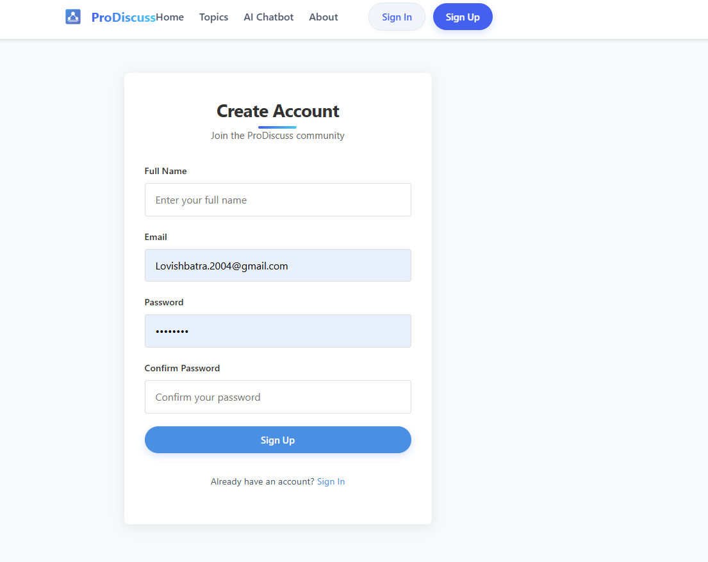
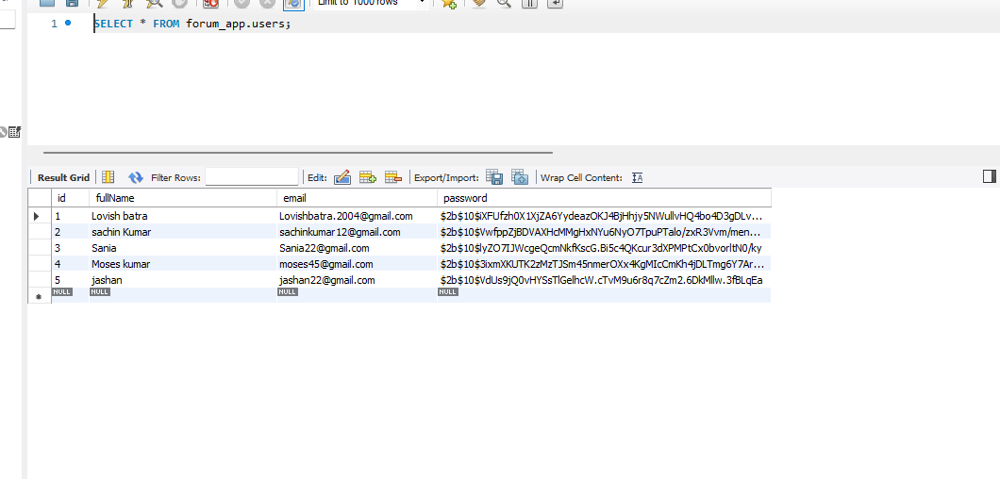
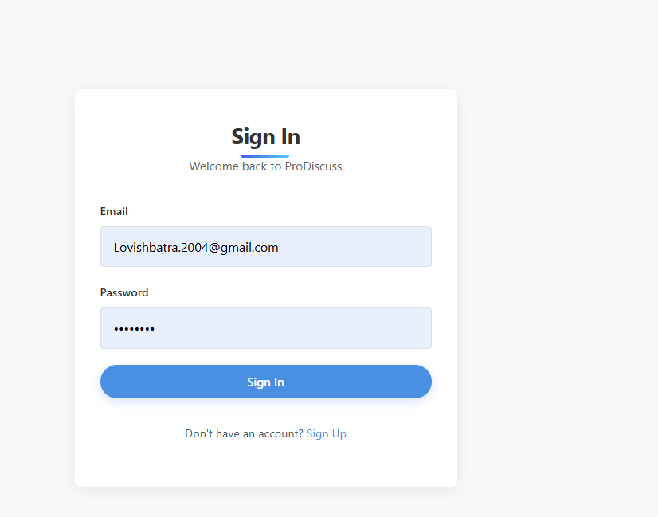
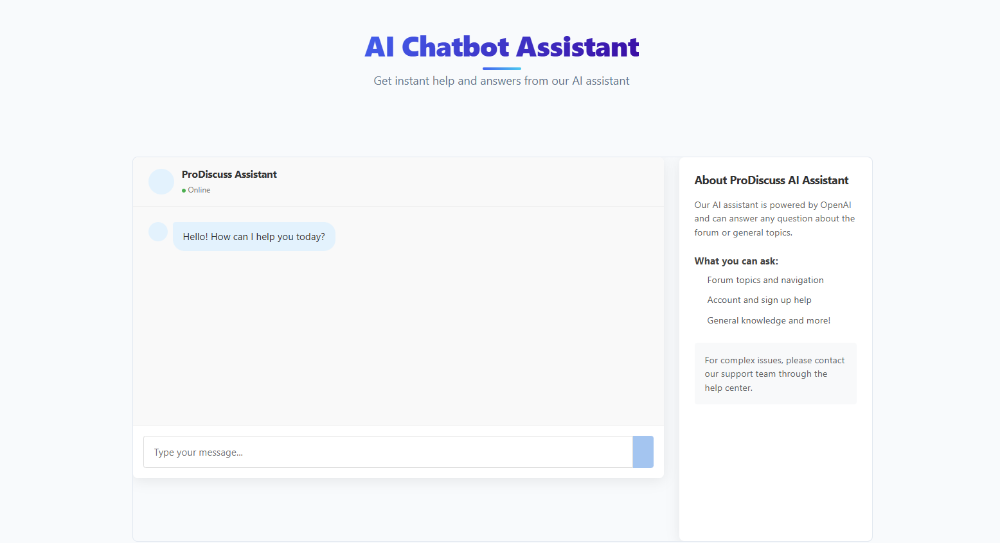

# ProDiscuss Discussion Board

## Team Members
- Lovish Batra (Lead Developer)
- Reeya Dhamu (Designer)
- Jashan Brar (Stakeholder)
- Class Code: TSW210

---

## Project Goal
Establish a modern, responsive web application using React and Vite, providing a seamless user experience for authentication, chatbot interaction, and topic management. The platform aims to facilitate meaningful discussions, easy topic management, and real-time chatbot support for users.

---

## Roles and Responsibilities
- **Project Manager:** Oversees project progress, ensures deadlines are met, and coordinates communication.
- **Frontend Developer(s):** Implements UI components, manages state, and ensures responsive design.
- **Backend Developer(s):** Develops and maintains server-side logic and APIs.
- **QA/Tester:** Tests features, reports bugs, and verifies deliverables.
- **Documentation Lead:** Maintains project documentation and updates the README and Project Plan.
- **Designer:** Designs UI/UX, creates wireframes, and ensures visual consistency.
- **Stakeholder:** Provides project requirements, feedback, and approves deliverables.

---

## Project Elements
- **Frontend:**
  - React SPA (Single Page Application)
  - Pages: Home, About, Chatbot, Sign In, Sign Up, Topics
  - Components: Navbar, Footer, Threads List, New Thread Form
  - Styling: CSS Modules
  - Responsive design for mobile and desktop
  - Accessibility features
  - 

- **Backend:**
  - Node.js/Express server (in `backend/`)
  - RESTful API endpoints
  - Database integration (future scope)
  - 

- **Authentication:**
  - User sign in/sign up
  - Session management
  - 

- **Chatbot Integration:**
  - Kommunicate or similar chatbot service
  - 

- **State Management:**
  - React Context or Redux (as needed)

---

## Tools, Frameworks, and Libraries
- React
- Vite
- Node.js
- Express
- Kommunicate (chatbot)
- CSS Modules
- ESLint
- Git & GitHub
- Trello (for task management)
- Figma (for design prototypes)

---

## Timeline & Milestones
- **Week 1:** Project setup, requirements gathering, initial planning, wireframing
- **Week 2:** Frontend and backend scaffolding, authentication flow, initial UI implementation
- **Week 3:** Chatbot integration, topic management features, API development
- **Week 4:** Testing, bug fixes, documentation, final review, deployment preparation

---

## Risks
- Integration issues between frontend and backend
- Delays in third-party service setup (e.g., chatbot)
- Unclear requirements or scope changes
- Team member availability
- Security vulnerabilities in authentication
- Incomplete documentation or missed deadlines

---

## Communication & Work Plan
- Weekly team meetings (in-person or virtual)
- Daily updates via group chat (Slack, Teams, or similar)
- Use GitHub for version control and issue tracking
- Assign tasks via project board (GitHub Projects, Trello, etc.)
- Documentation maintained in README and separate Project Plan file
- Design reviews using Figma
- Regular stakeholder feedback sessions

---

*Update this document as the project progresses to reflect changes in scope, roles, or deliverables.*